# Laporan Praktikum Basis Data - Pertemuan 1

**Nama:** Zahra Zakia An Nur    
**NPM:** 25430056    
**Kelas:** B    
**Tanggal:** 4 Oktober 2026

## 1. Tujuan Praktikum

Tujuan dari sesi praktik ini adalah menyiapkan lingkungan kerja basis data—yaitu, menjalankan MariaDB melalui XAMPP dan terhubung ke server menggunakan CLI atau phpMyAdmin. Selain itu, praktik ini juga membahas cara mengamankan akun root, membuat akun pengguna dengan akses terbatas, serta memanfaatkan GitHub dan Git untuk mencatat seluruh proses kerja.

## 2. Ringkasan Dasar Teori

MariaDB menggunakan struktur klien-server. Server (mysqld) melakukan pekerjaan dan berjalan di latar belakang, merespons permintaan dari klien—misalnya klien command line Mysql mysql atau antarmuka web phpMyAdmin. Keduanya hanya perantara; data dan aturan akses tetap ada di server.

Akun-akun MariaDB didefinisikan dengan kombinasi nama pengguna plus host, misalnya mhs_056@localhost. Berikan hanya izin yang benar-benar diperlukan untuk setiap akun (prinsip least privilege). Inilah sebabnya akun root yang memiliki hak penuh memiliki kata sandi, dan mengapa tugas-tugas sehari-hari dijalankan sebagai akun dengan hak lebih rendah, seperti mhs_056 dan dev_056.

Git dipakai sebagai catatan kerja. Setiap perubahan disimpan sebagai commit dengan pesan yang menjelaskan isinya, lalu dikirim ke GitHub dengan push sehingga riwayat pekerjaan dapat diperiksa.

## 3. Hasil Langkah Percobaan

### D.1 Menjalankan Layanan MariaDB

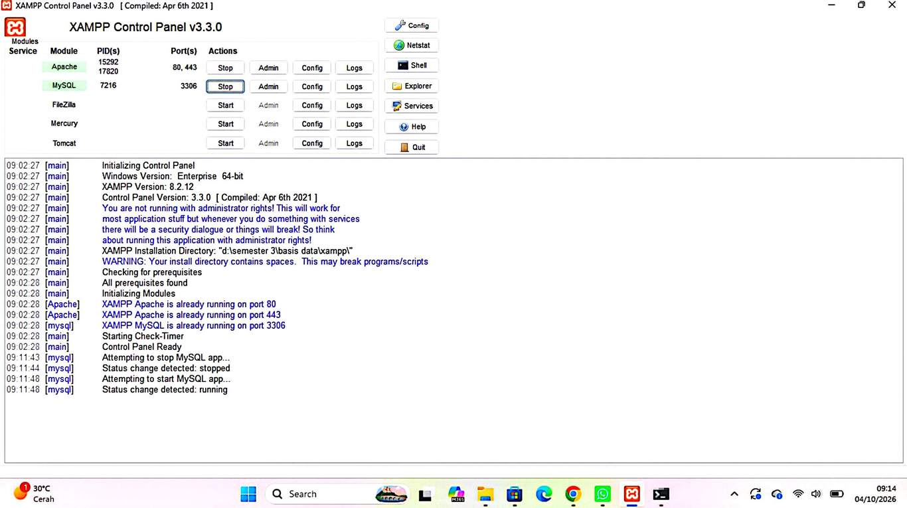

Gambar 3.1 menunjukkan modul MySQL di XAMPP Control Panel berjalan pada port 3306. Versi XAMPP yang dipakai adalah 8.2.12, dan jam sistem terlihat di pojok kanan bawah.

### D.2 Masuk Melalui Klien Baris Perintah

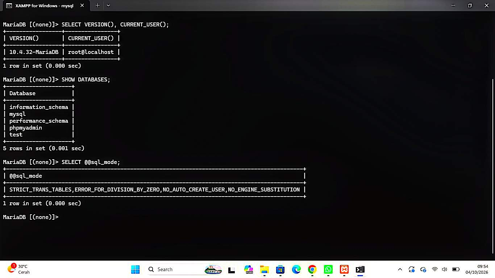

Pada Gambar 3.2 saya masuk sebagai `root` lewat tombol Shell XAMPP. `VERSION()` menampilkan `10.4.32-MariaDB` dan `CURRENT_USER()` menampilkan `root@localhost`. `SHOW DATABASES` menampilkan lima database bawaan, dan `@@sql_mode` sudah memuat `STRICT_TRANS_TABLES`.

### D.3 Mengamankan Akun root

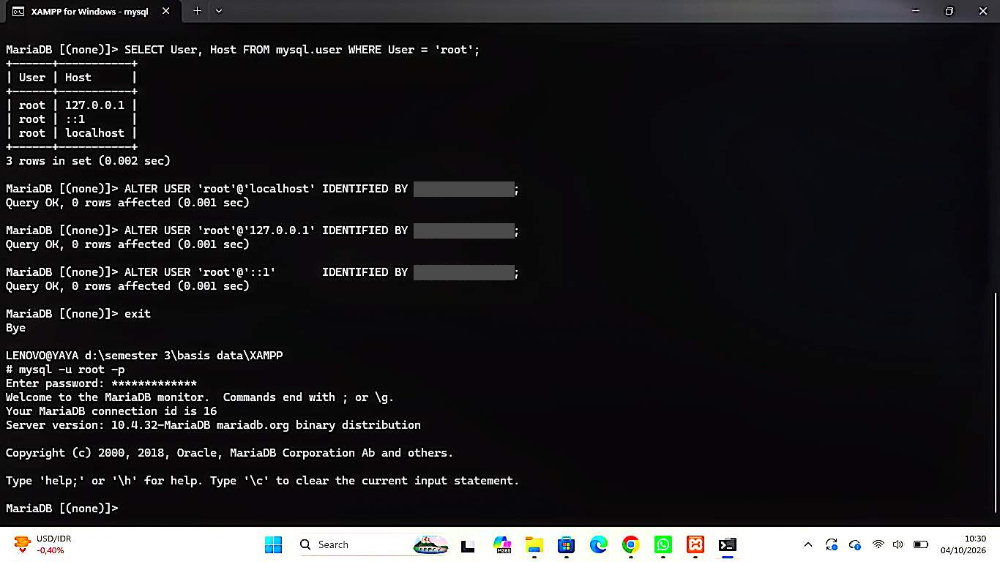

Gambar 3.3 menunjukkan password diberikan pada tiga akun root, yaitu `localhost`, `127.0.0.1`, dan `::1`. Masing-masing perintah menghasilkan `Query OK`, dan password pada gambar sudah ditutup.

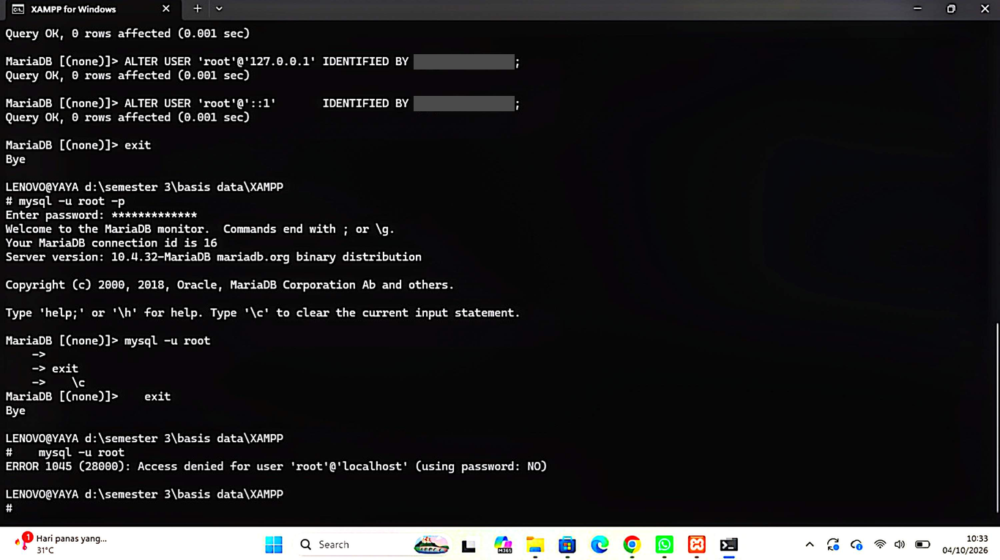

Gambar 3.4 memperlihatkan percobaan masuk dengan `mysql -u root` tanpa `-p` setelah root berpassword. Hasilnya `ERROR 1045 (28000)` dengan keterangan `using password: NO`.

### D.4 Membuat Basis Data dan Akun Kerja

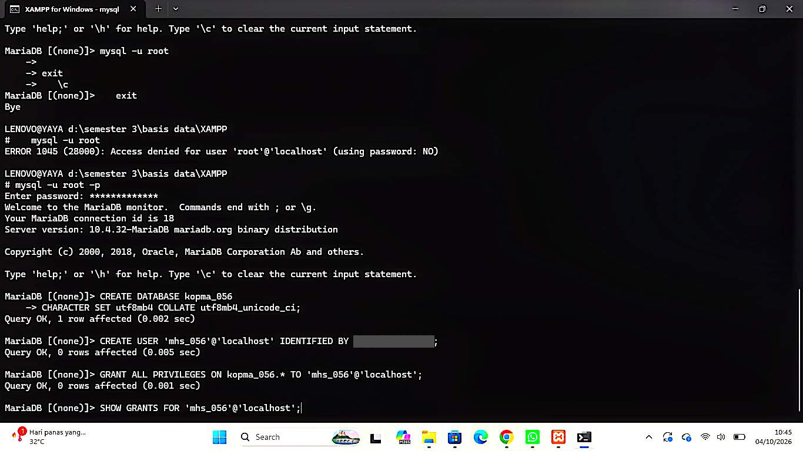

Gambar 3.5 menunjukkan pembuatan database `kopma_056` dengan set karakter `utf8mb4`, pembuatan akun `mhs_056`, pemberian hak, dan hasil `SHOW GRANTS` yang menunjukkan hak `ALL PRIVILEGES` hanya pada `kopma_056`.

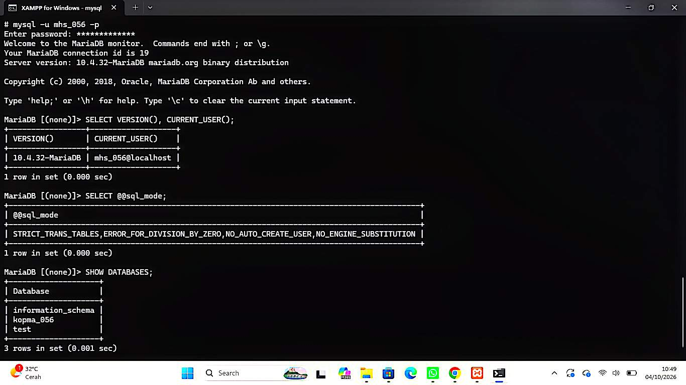

Pada Gambar 3.6 saya masuk sebagai `mhs_056`. `CURRENT_USER()` menampilkan `mhs_056@localhost`, `@@sql_mode` memuat `STRICT_TRANS_TABLES`, dan `SHOW DATABASES` menampilkan `information_schema`, `kopma_056`, dan `test`.

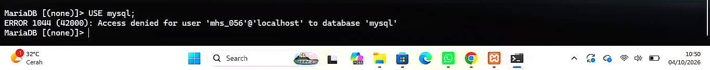

Gambar 3.7 menunjukkan perintah `USE mysql;` oleh `mhs_056` ditolak dengan `ERROR 1044`, karena akun ini tidak punya hak atas database `mysql`.

### D.5 Menggunakan phpMyAdmin dengan Aman

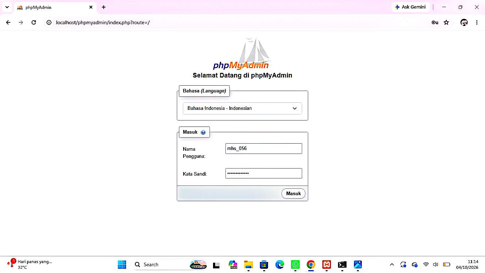

Setelah `auth_type` di `config.inc.php` diubah menjadi `cookie`, phpMyAdmin menampilkan halaman login (Gambar 3.8) dan tidak lagi langsung masuk sebagai root.

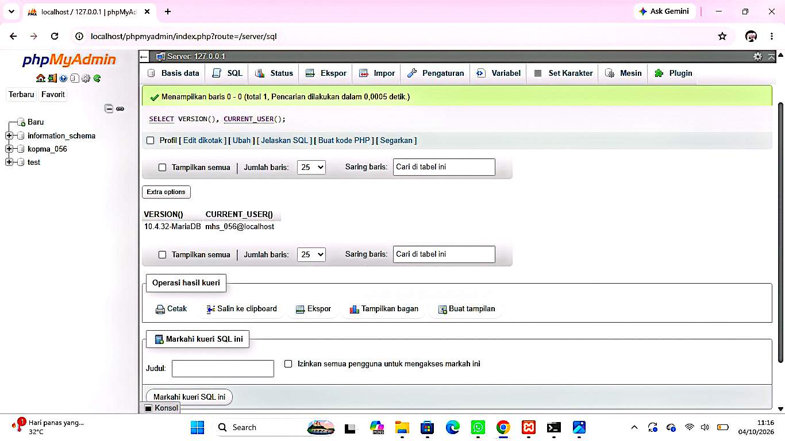

Gambar 3.9 menunjukkan kueri `SELECT VERSION(), CURRENT_USER();` di tab SQL setelah login sebagai `mhs_056`. Hasilnya `10.4.32-MariaDB` dan `mhs_056@localhost`, sama dengan hasil di CLI.

### D.6 Menyiapkan Repositori Git

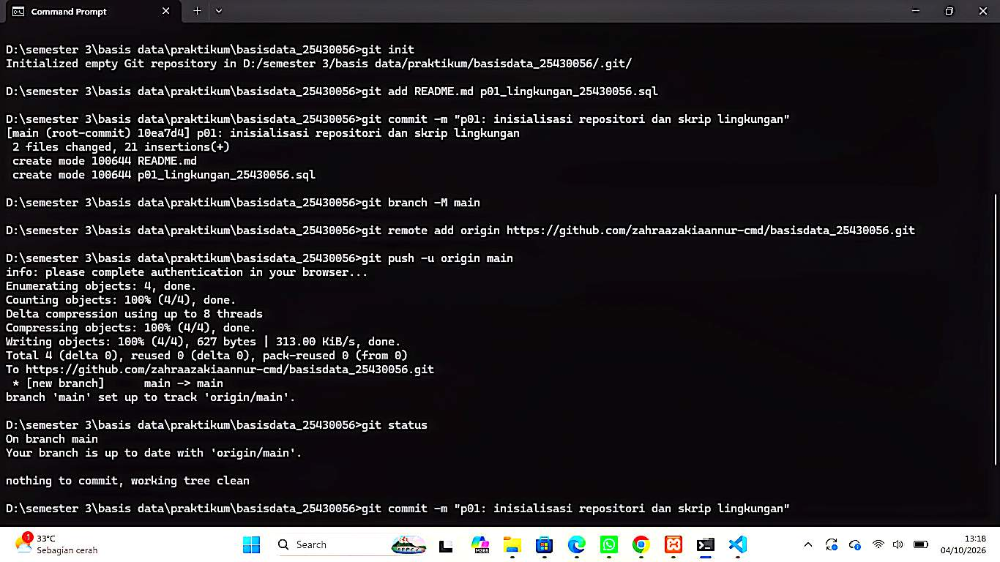

Gambar 3.10 memperlihatkan `git init`, `git add`, `git commit` (2 berkas), dan `git push` pertama yang berhasil ke cabang `main`, sehingga repositori lokal terhubung ke GitHub.

## 4. Jawaban Titik Analisis

**Titik Analisis 1**

Label tombol bertuliskan "MySQL", tetapi yang berjalan adalah MariaDB. Apa konsekuensinya ketika mencari solusi galat di internet? Kapan dokumentasi MySQL masih relevan, dan kapan harus merujuk ke dokumentasi MariaDB?

MariaDB adalah turunan (fork) dari MySQL, sehingga nama program `mysql` dan banyak perintah dasarnya masih sama. Akibatnya, hasil pencarian untuk "MySQL" sering terlihat cocok padahal belum tentu berlaku. Jawaban yang ditulis untuk MySQL 8, misalnya, bisa merujuk ke fitur, variabel sistem, atau plugin autentikasi yang berbeda dari MariaDB 10.4, sehingga perintahnya bisa gagal atau hasilnya berbeda.

Dokumentasi MySQL masih relevan untuk hal dasar yang sama pada keduanya, seperti sintaks SQL umum (`SELECT`, `CREATE DATABASE`, `GRANT`) dan cara memakai klien `mysql`. Dokumentasi MariaDB perlu dijadikan acuan untuk hal yang bergantung versi dan implementasi, seperti nilai bawaan `sql_mode`, pengaturan di `my.ini`, pengelolaan akun dan autentikasi, serta pesan galat tertentu. Pada praktikum ini versi yang berjalan adalah 10.4.32-MariaDB, jadi saya mengecek versi terlebih dahulu dengan `SELECT VERSION();` sebelum mengikuti solusi dari internet.

**Titik Analisis 2**

Coba masuk dengan `mysql -u root` tanpa `-p`. Catat pesan galat. Bagian mana dari pesan itu yang memberi tahu bahwa klien tidak mengirim password? Bandingkan dengan Gambar 1.10 di buku.

Pesan yang muncul adalah `ERROR 1045 (28000): Access denied for user 'root'@'localhost' (using password: NO)`. Bagian yang memberi tahu bahwa klien tidak mengirim password adalah keterangan di ujung pesan, yaitu `using password: NO`. Artinya server menerima percobaan login tanpa password sama sekali, lalu menolaknya karena akun root sudah berpassword.

Sebagai pembanding, saya pernah salah mengetik password root saat memasukkannya lewat `-p`. Pesannya hampir sama, tetapi berakhiran `using password: YES`. Jadi `YES` berarti password terkirim tetapi salah, sedangkan `NO` berarti password tidak dikirim. [SESUAIKAN: bandingkan juga dengan isi Gambar 1.10 di buku.]

**Titik Analisis 3**

Mengapa `information_schema` tetap terlihat oleh `mhs_056`, sedangkan `mysql` ditolak dengan ERROR 1044? Apa bedanya kode galat 1044 dengan 1045?

`information_schema` adalah database virtual berisi informasi tentang struktur server (metadata), dan dibuat dapat dilihat oleh semua akun yang sudah berhasil login. Isinya pun dibatasi sesuai hak masing-masing akun. Sebaliknya, database `mysql` menyimpan data internal sensitif seperti daftar akun dan hak akses, sehingga hanya akun berhak tinggi yang boleh mengaksesnya. Karena `mhs_056` hanya diberi hak atas `kopma_056`, perintah `USE mysql;` ditolak dengan ERROR 1044. Pada `SHOW DATABASES` untuk `mhs_056` juga muncul `test`, database bawaan yang memang dibuka untuk semua akun.

Perbedaan 1044 dan 1045 ada pada tahapnya. ERROR 1045 terjadi saat login: server menolak karena autentikasi gagal (password salah atau tidak dikirim). ERROR 1044 terjadi setelah login berhasil: akun sudah dikenali, tetapi ditolak ketika mengakses database yang bukan haknya.

**Titik Analisis 4**

Mode `cookie` meminta password setiap kali masuk. Mengapa mode ini lebih aman daripada mode `config` yang menyimpan password di berkas konfigurasi?

Pada mode `config`, nama pengguna dan password disimpan di berkas `config.inc.php`, lalu phpMyAdmin masuk otomatis tanpa meminta apa pun. Akibatnya, siapa pun yang dapat membuka alamat phpMyAdmin langsung mendapat akses ke server, sering kali sebagai root, dan password tersimpan sebagai teks biasa di berkas yang bisa terbaca atau tidak sengaja tersebar.

Pada mode `cookie`, password tidak disimpan di berkas konfigurasi. phpMyAdmin menampilkan halaman login, lalu pengguna memasukkan kredensialnya sendiri setiap kali masuk. Mode ini juga memungkinkan login dengan akun terbatas seperti `mhs_056`, sehingga hak akses yang didapat sesuai akun yang dipakai, bukan selalu hak penuh root.

**Perbedaan kode galat 1044, 1045, dan 1142**

| Kode | Kapan muncul (di percobaan saya) | Maknanya |
|---|---|---|
| 1044 | `USE mysql;` oleh `mhs_056`, dan `USE kopma_056;` oleh `dev_056` | Sudah login, tetapi ditolak mengakses database yang bukan haknya. |
| 1045 | `mysql -u root` tanpa `-p`, dan saat salah mengetik password | Login gagal karena password tidak dikirim atau salah. |
| 1142 | `CREATE TABLE uji (id INT);` oleh `tamu_056` | Sudah login dan boleh membuka database, tetapi perintah tertentu (`CREATE`) ditolak karena hak tidak mencukupi. |

## 5. Hasil Latihan dan Modifikasi

### Latihan E1: akun tamu_056 (hanya SELECT)

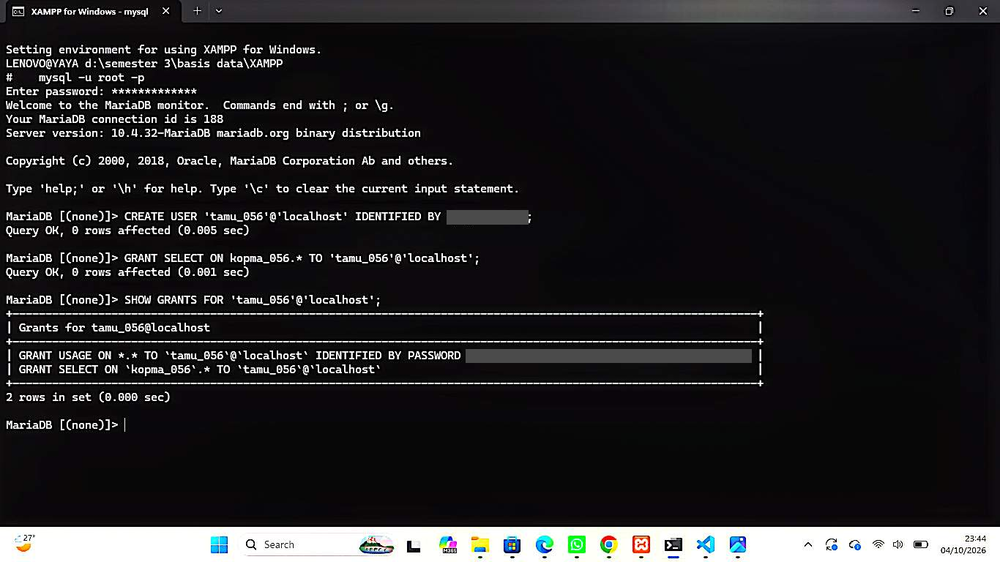

Akun `tamu_056` dibuat dan hanya diberi hak `SELECT` pada `kopma_056` (Gambar 5.1).

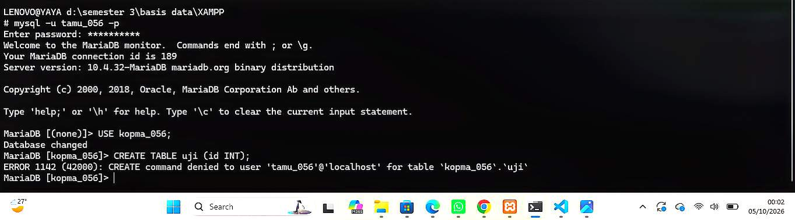

Setelah login sebagai `tamu_056` dan menjalankan `USE kopma_056;` (berhasil), perintah `CREATE TABLE uji (id INT);` ditolak dengan `ERROR 1142 (42000): CREATE command denied to user 'tamu_056'@'localhost' for table kopma_056.uji`. Artinya akun ini boleh membuka database dan membaca isinya, tetapi tidak boleh membuat tabel karena hak `CREATE` tidak diberikan.

### Latihan E2: skrip dapat dijalankan berulang

Isi akhir `p01_lingkungan_25430056.sql` (password tetap berupa penanda):

```sql
-- p01_lingkungan_25430056.sql (password diganti penanda)
CREATE DATABASE IF NOT EXISTS kopma_056
  CHARACTER SET utf8mb4 COLLATE utf8mb4_unicode_ci;
CREATE USER IF NOT EXISTS 'mhs_056'@'localhost' IDENTIFIED BY '<password_kerja>';
GRANT ALL PRIVILEGES ON kopma_056.* TO 'mhs_056'@'localhost';
```

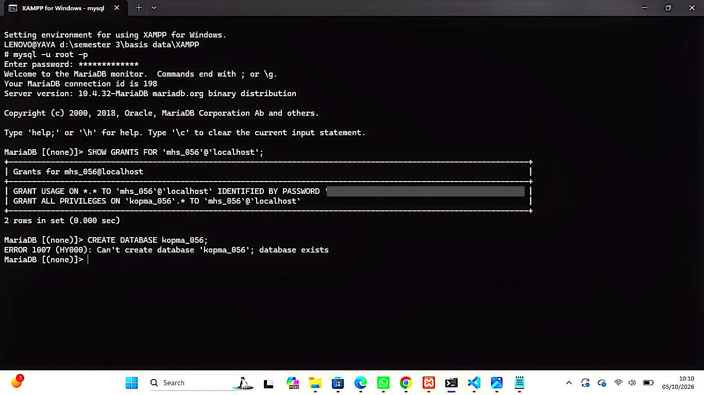

Skrip versi lama gagal ketika dijalankan ulang dengan `ERROR 1007 (HY000) at line 2: Can't create database 'kopma_056'; database exists` (Gambar 5.3), karena database sudah ada.

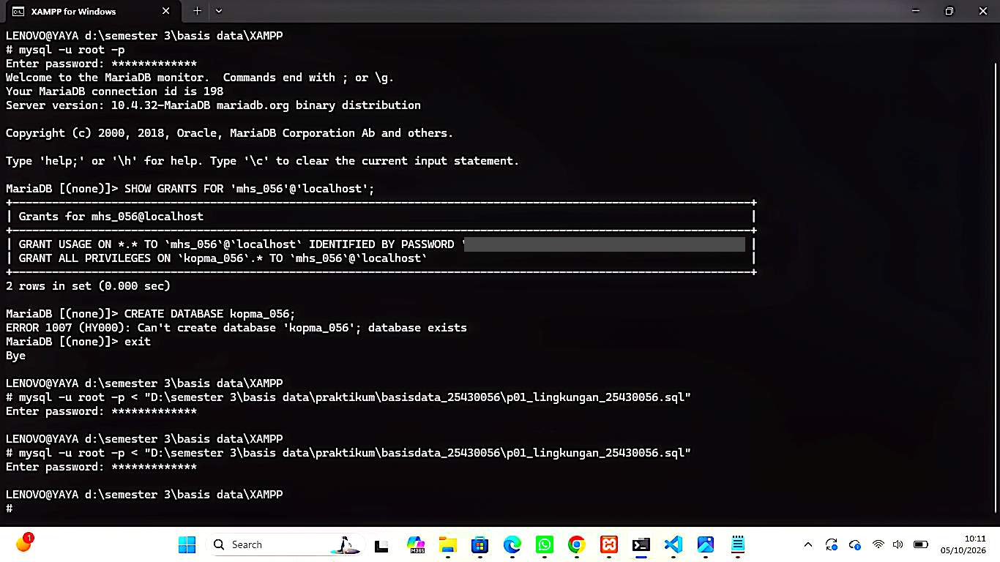

Saya menambahkan `IF NOT EXISTS` pada `CREATE DATABASE` dan `CREATE USER`, sehingga perintah dilewati jika objeknya sudah ada. `GRANT` tidak perlu diubah karena memberi hak yang sama berulang kali tidak menimbulkan galat. Setelah perubahan, skrip dijalankan dua kali dengan `mysql -u root -p < p01_lingkungan_25430056.sql` dan keduanya selesai tanpa galat (Gambar 5.4). Karena akun `mhs_056` sudah ada, password lamanya tidak berubah.

## 6. Tugas Mandiri: Milestone Proyek 1

| Item | Isian |
|---|---|
| Tema proyek | Perpustakaan |
| Nama organisasi fiktif |  Yaya Library  |
| Database proyek | `perpus_056` |
| Akun proyek | `dev_056` |

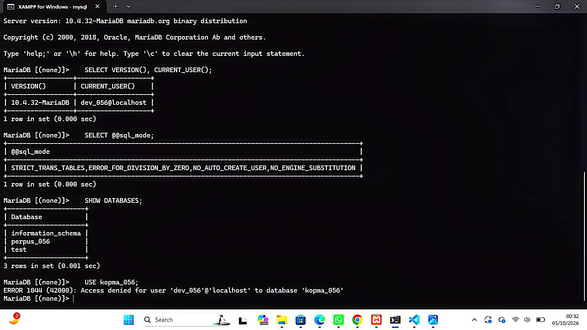

Gambar 6.1 menunjukkan login sebagai `dev_056`. `SHOW DATABASES` menampilkan `information_schema`, `perpus_056`, dan `test`, sedangkan `kopma_056` tidak muncul. Percobaan `USE kopma_056;` ditolak dengan `ERROR 1044`, sehingga terbukti `dev_056` hanya berhak atas database proyeknya sendiri.

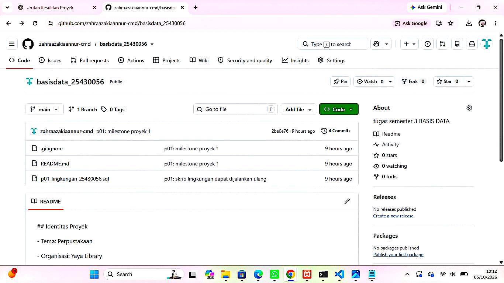

Gambar 6.2 menunjukkan `README.md` yang memuat Identitas Proyek dan `.gitignore` yang mengecualikan `*.env` dan `kredensial*.txt`, sehingga berkas yang berisi kredensial tidak ikut tersimpan di repositori.

Penjelasan keputusan desain: koleksi dibatasi 5 per anggota agar koleksi terbagi merata; masa pinjam 7 hari agar perputaran koleksi cukup cepat; denda Rp3.000 per hari per koleksi bersifat ringan namun mendorong pengembalian tepat waktu; data anggota mencakup NIM, nama, program studi, nomor HP, dan tanggal pendaftaran karena layanan ditujukan untuk mahasiswa.

## 7. Pembahasan dan Kendala

Kendala pertama adalah mode SQL. Pada pemeriksaan awal, `@@sql_mode` bernilai `NO_ZERO_IN_DATE,NO_ZERO_DATE,NO_ENGINE_SUBSTITUTION`, tanpa `STRICT_TRANS_TABLES`. Dalam mode ini data yang tidak sesuai hanya memicu peringatan dan tetap disimpan. Saya memperbaikinya dengan mengubah baris `sql_mode` pada bagian `[mysqld]` di `my.ini` menjadi `STRICT_TRANS_TABLES,ERROR_FOR_DIVISION_BY_ZERO,NO_AUTO_CREATE_USER,NO_ENGINE_SUBSTITUTION`, lalu memulai ulang MySQL. Setelah itu hasilnya sudah memuat `STRICT_TRANS_TABLES` (Gambar 3.2).

Kendala kedua, saat login root ada percobaan yang gagal dengan `ERROR 1045 ... using password: YES`. Penyebabnya salah mengetik password, dan setelah diketik ulang dengan teliti login berhasil. Kendala ketiga, perintah `mysql` tidak dikenali di Command Prompt biasa karena folder XAMPP belum masuk PATH, sehingga perintah `mysql` dijalankan lewat tombol Shell di XAMPP Control Panel.

Kendala berikutnya, XAMPP terpasang di folder yang path-nya mengandung spasi (`d:\semester 3\basis data\xampp`), dan XAMPP memberi peringatan soal ini. Selama praktikum tidak ada perintah yang gagal karena hal itu, tetapi path pada perintah harus ditulis dengan tanda kutip. Pada pengaturan phpMyAdmin, baris `auth_type` perlu dicari dengan kata kunci pendek karena penulisan spasinya berbeda dari contoh.

Pada Latihan E2, skrip lama menghasilkan `ERROR 1007` saat diulang, dan diperbaiki dengan `IF NOT EXISTS`. Saat menguji skrip, pernah muncul `ERROR 1045` karena password root salah ketik. Selain itu, tampilan `README.md` di GitHub sempat tampil sebagai teks biasa.

## 8. Kesimpulan

Praktikum ini berhasil menyiapkan lingkungan kerja basis data: MariaDB berjalan di XAMPP dengan mode SQL ketat, akun root sudah berpassword, dan akun kerja (`mhs_056`, `dev_056`, `tamu_056`) dibatasi sesuai kebutuhan. Pengujian galat 1044, 1045, dan 1142 menunjukkan perbedaan antara gagal login, ditolak mengakses database, dan ditolak menjalankan perintah tertentu. Seluruh pekerjaan tercatat bertahap dalam empat commit di GitHub, dan lingkungan ini siap dipakai untuk proyek perpustakaan pada modul berikutnya.

## 9. Pernyataan Penggunaan AI

| Butir | Isian |
|---|---|
| Alat yang dipakai | Claude |
| Dipakai untuk | Memandu langkah praktikum, menjelaskan pesan galat, memeriksa hasil dan draf paragraf lingkup layanan, serta menyusun draf awal teks laporan atas izin dosen |
| Bagian laporan terkait | Seluruh bagian teks laporan (draf awal), yang kemudian saya baca, sesuaikan, dan ubah dengan bahasa saya sendiri |
| Yang dikerjakan sendiri | Seluruh pengerjaan praktikum dan proyek di komputer, pengambilan semua tangkapan layar, pemilihan tema dan nama organisasi, penulisan paragraf lingkup layanan, serta commit dan push ke GitHub |


## 10. Bukti Git

Tautan repositori: https://github.com/zahraazakiaannur-cmd/basisdata_25430056

| Hash commit | Pesan commit | Keterangan |
|---|---|---|
| `10ea7d4` | p01: inisialisasi repositori dan skrip lingkungan | Commit pertama: `README.md` dan skrip lingkungan |
| `12ca7f3` | p01: perbaiki format README | Perbaikan isi `README.md` |
| `2ee7526` | p01: skrip lingkungan dapat dijalankan ulang | Skrip diubah dengan `IF NOT EXISTS` (Latihan E2) |
| `2be0e76` | p01: milestone proyek 1 | Identitas Proyek di `README.md` dan `.gitignore` |

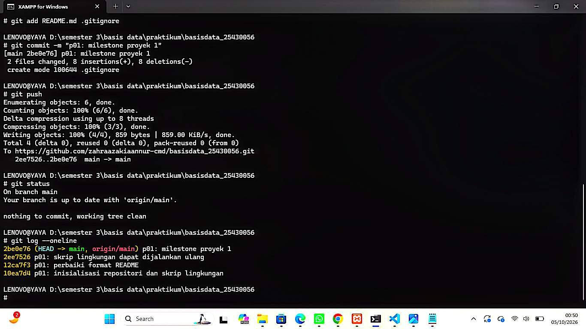

## Checklist

**Checklist umum**

- [ ] Identitas: nama, NIM, kelas, pertemuan, tanggal, nama asisten/dosen
- [ ] Tujuan: bahasa sendiri, maksimal 5 baris
- [ ] Ringkasan teori: pemahaman sendiri, maksimal setengah halaman
- [ ] Langkah percobaan (D): tangkapan layar langkah kunci dengan keterangan
- [ ] Titik Analisis: semua dijawab lengkap dengan alasan
- [ ] Latihan (E): skrip hasil latihan beserta bukti berjalan
- [ ] Tugas Mandiri (F): berkas, bukti, dan penjelasan keputusan desain
- [ ] Pembahasan dan kendala: galat, cara membaca, cara mengatasi
- [ ] Kesimpulan: dua sampai empat kalimat
- [ ] Pernyataan Penggunaan AI: alat, untuk apa, bagian mana
- [ ] Bukti Git: tautan repositori dan hash commit berpesan `p01: ...`
- [ ] Keaslian: akun ber-NIM dan jam sistem terlihat; nama objek memuat NIM/inisial

**Checklist khusus Pertemuan 1**

- [ ] Berkas wajib: `p01_lingkungan_<NIM>.sql` (dapat dijalankan ulang), `README.md` berisi Identitas Proyek, `.gitignore`
- [ ] Bukti tangkapan layar: VERSION/CURRENT_USER, sql_mode, SHOW DATABASES sebagai `mhs_<3d>` dan `dev_<3d>`; galat 1044 dan 1142; halaman login phpMyAdmin mode cookie; `git push` pertama
- [ ] Analisis wajib: Titik Analisis 1-4; perbedaan kode galat 1044, 1045, dan 1142
