# Laporan Praktikum Basis Data - Pertemuan 02

**Nama:** Zahra Zakia An Nur    
**NPM:** 25430056  
**Kelas:** B   
**Tanggal:** 5 oktober 2026  

## 1. Tujuan Praktikum

Pada pertemuan ini saya belajar menggali apa saja yang harus disimpan sebuah organisasi sebelum membuat basis data. Saya berlatih mengenali proses bisnis dan pelakunya dari cerita dan wawancara, membedah nota untuk menemukan elemen data, lalu menuliskan entitas, aturan bisnis, kebutuhan informasi, matriks CRUD, dan kamus data. Saya juga berlatih menulis kebutuhan yang jelas dan bisa diuji.

## 2. Ringkasan Dasar Teori

Analisis kebutuhan adalah tahap pertama perancangan basis data, dan kesalahan di tahap ini paling mahal karena data yang sudah hilang (misalnya harga lama) tidak bisa dipulihkan. Data dipandang sebagai aset organisasi yang punya penanggung jawab. Kebutuhan dikelompokkan menjadi kebutuhan data, kebutuhan informasi, aturan bisnis, dan kebutuhan non-fungsional. Matriks CRUD dipakai untuk memeriksa proses yang terlewat, dan kamus data menjadi bahasa bersama antara analis dan pengguna. Pernyataan kebutuhan yang baik harus spesifik, terukur, dan dapat diuji.

## 3. Hasil Langkah Percobaan

Berkas dikerjakan di repositori `basisdata_25430056`: `p02_kebutuhan_data_kopma_25430056.md`.

- **D.2 Aktor dan proses bisnis.** Lima proses dari narasi (PB-01 sampai PB-05), ditambah PB-06 sampai PB-08 setelah pemeriksaan matriks CRUD.  
  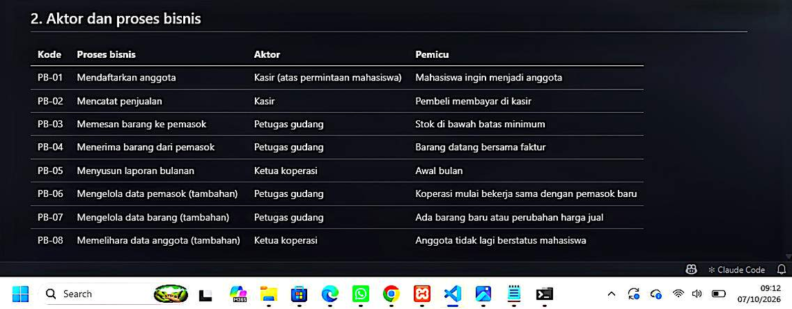
- **D.3 Membedah nota.** Setiap isian nota ditandai disimpan atau turunan (harga saat transaksi disimpan, subtotal dan total turunan).  
  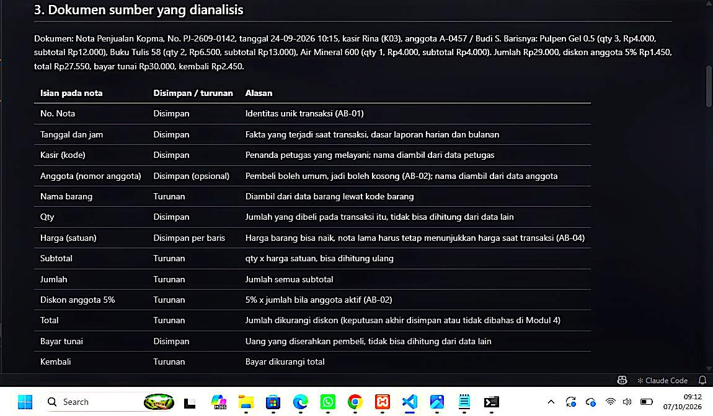
- **D.4 Entitas dan aturan bisnis.** Tujuh entitas kandidat dan enam aturan bisnis (AB-01 sampai AB-06).  
  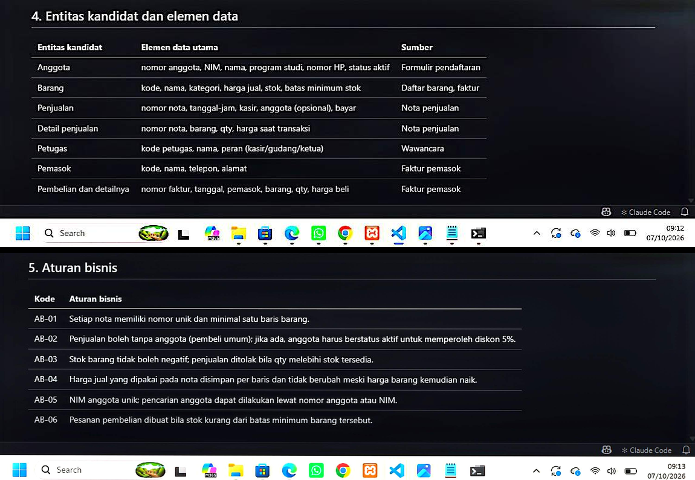
- **D.5 Kebutuhan informasi dan matriks CRUD.** Empat kebutuhan informasi (KI-01 sampai KI-04) dan matriks CRUD proses terhadap enam entitas.  
  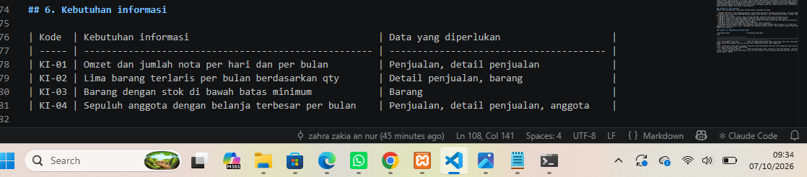
- **D.6 Kamus data awal dan non-fungsional.** Kamus data dengan kolom penanggung jawab, perkiraan 150 nota per hari, retensi 5 tahun, dan pembatasan akses nomor HP.  
  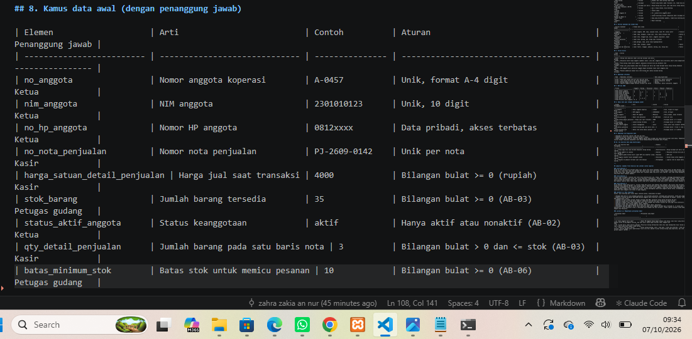
- **D.7 Dokumen dan commit.** Commit dengan pesan `p02: dokumen kebutuhan data kopma`.

## 4. Jawaban Titik Analisis

**Titik Analisis 1.** Harga di data barang bisa berubah kapan saja. Kalau nota hanya mengambil harga lewat relasi ke data barang, setiap kenaikan harga ikut mengubah total nota lama dan membuat omzet lama salah. Itu sumber keluhan ketua yang bingung melihat nota lama. Jika harga saat transaksi disimpan per baris nota (AB-04), nota lama tetap menunjukkan harga yang benar-benar dibayar.

**Titik Analisis 2.** Alasan tidak menyimpan subtotal dan total: nilainya bisa dihitung dari qty, harga, dan diskon, sehingga menyimpannya berisiko tidak sinkron kalau salah satu nilai dikoreksi. Alasan total mungkin tetap disimpan: total adalah angka yang tercetak dan dibayar pada nota, jadi menyimpannya membekukan nilai itu sebagai bukti jika aturan diskon berubah, dan laporan omzet lebih cepat karena tidak perlu menghitung ulang semua baris. Keputusan akhir akan dibahas di Modul 4.

**Titik Analisis 3.** Kolom Pemasok tidak memiliki huruf C, artinya tidak ada proses yang membuat data pemasok sehingga ada proses yang terlewat, yaitu mengelola data pemasok (PB-06, petugas gudang). Saya juga menemukan kolom Barang tidak punya C, sehingga saya menambahkan PB-07 mengelola data barang. Untuk status aktif anggota, tidak ada proses yang mengubahnya; karena penanggung jawab data anggota adalah ketua, saya menambahkan PB-08 memelihara data anggota oleh ketua.

**Perhitungan parameter P.** P = (2 digit terakhir NIM mod 9) + 1 = (56 mod 9) + 1 = 2 + 1 = **3**. Batas item per transaksi = P + 2 = 5; denda harian = P ribu rupiah = Rp3.000; volume harian = 40 + 5 x 3 = 55 transaksi.

## 5. Hasil Latihan dan Modifikasi

**Latihan E.1: poin loyalitas.** Poin dihitung dari total bayar setelah diskon, dibulatkan ke bawah.

- Elemen data baru: poin_didapat_penjualan, poin_ditukar_penjualan, potongan_poin_penjualan, saldo_poin_anggota.
- AB-07: setiap kelipatan Rp10.000 belanja anggota aktif bernilai 1 poin (contoh: Rp27.550 menghasilkan 2 poin).
- AB-08: 50 poin dapat ditukar potongan Rp5.000, hanya dalam kelipatan 50 poin.
- AB-09: saldo poin tidak boleh negatif; penukaran ditolak bila poin kurang.
- AB-10: pembeli umum tidak memperoleh poin; poin didapat dan ditukar dicatat per nota.
- KI-05: saldo poin setiap anggota. KI-06: total poin diterbitkan dan ditukar per bulan.
- Matriks CRUD: PB-02 pada kolom Anggota berubah dari R menjadi R, U.

**Latihan E.2: memperbaiki pernyataan kabur.**

| Pernyataan kabur                        | Pernyataan yang dapat diuji                                                                                                                                       |
| --------------------------------------- | ----------------------------------------------------------------------------------------------------------------------------------------------------------------- |
| (a) "data anggota harus aman"           | Nomor HP anggota hanya dapat dibaca ketua; akun kasir yang membaca kolom no_hp_anggota ditolak, dan kasir hanya melihat nomor anggota dan nama.                    |
| (b) "sistem harus cepat mencari barang" | Pencarian barang berdasarkan kode atau nama menampilkan hasil paling lama 2 detik pada data sampai 2.000 barang.                                                   |
| (c) "laporan stok harus akurat"         | Stok = stok awal + total qty diterima - total qty terjual; selisih dengan pemeriksaan fisik sore hari adalah 0 untuk setiap barang yang diperiksa, dan stok tidak pernah negatif (AB-03). |

## 6. Tugas Mandiri: Milestone Proyek 2

Berkas: `p02_kebutuhan_data_25430056.md` (proyek Yaya Library, database `perpus_056`).  
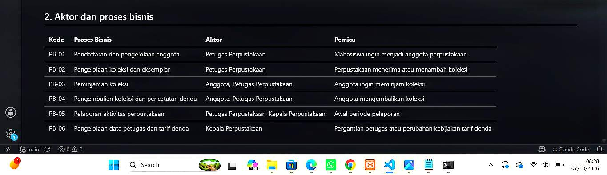

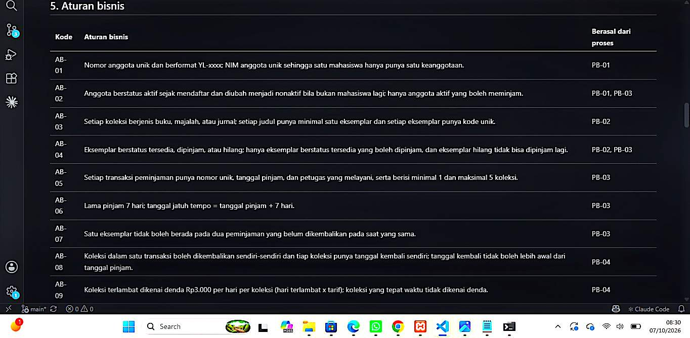

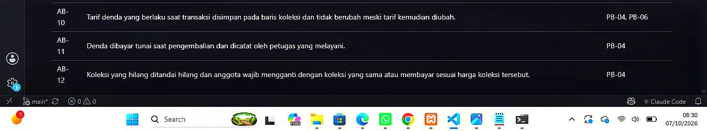

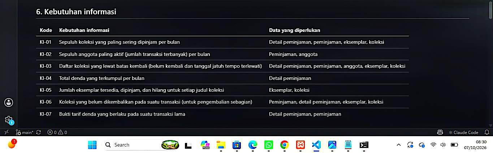

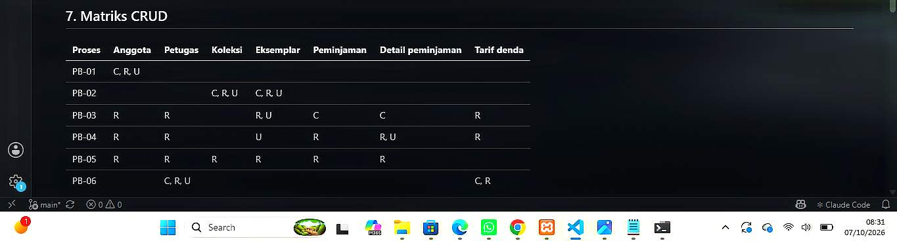

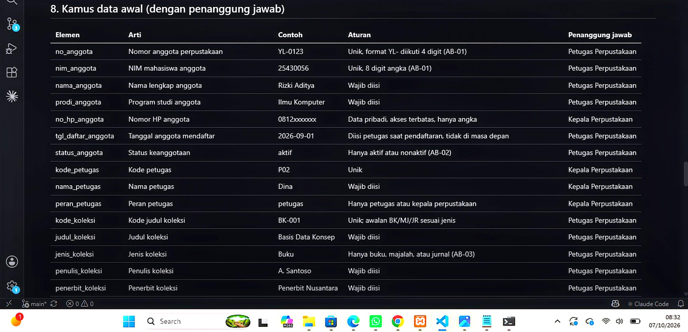

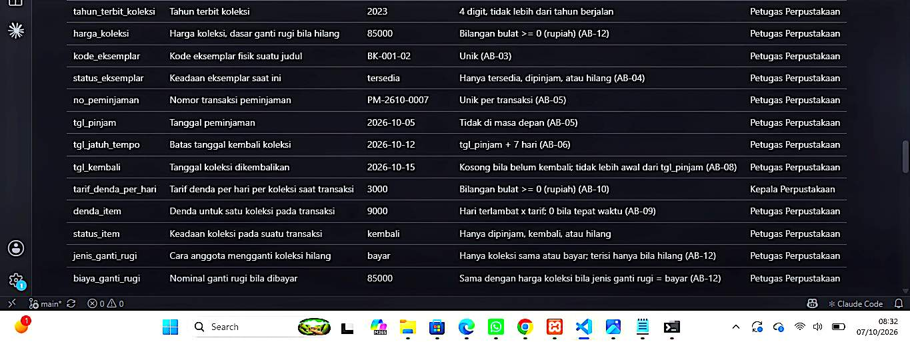

| Ketentuan minimum                          | Hasil                                                                              |
| ------------------------------------------ | ---------------------------------------------------------------------------------- |
| Minimal 4 proses bisnis                    | 6 proses (PB-01 sampai PB-06)                                                      |
| Minimal 6 entitas kandidat                 | 7 entitas (Anggota, Petugas, Koleksi, Eksemplar, Peminjaman, Detail peminjaman, Tarif denda) |
| Minimal 8 aturan bisnis                    | 12 aturan (AB-01 sampai AB-12)                                                     |
| Minimal 5 kebutuhan informasi              | 7 kebutuhan (KI-01 sampai KI-07)                                                   |
| Matriks CRUD tanpa entitas yatim           | Setiap entitas punya minimal satu C                                                |
| Kamus data minimal 20 elemen               | 28 elemen dengan penanggung jawab                                                  |
| Non-fungsional dan data pribadi            | Volume, retensi 5 tahun, dan tabel akses data pribadi                              |
| Dokumen sumber fiktif                      | Slip Peminjaman dan Pengembalian Yaya Library beserta pembedahannya                |

**Keputusan desain dan alasannya:**

1. Koleksi dan Eksemplar dipisah karena satu judul punya banyak eksemplar dan petugas perlu tahu eksemplar mana yang sedang keluar.
2. Tarif denda disimpan per baris detail peminjaman (AB-10) dan ada entitas Tarif denda, supaya tarif lama bisa dibuktikan, sesuai keluhan kepala perpustakaan.
3. Tanggal kembali disimpan per baris detail peminjaman (AB-08) karena anggota sering mengembalikan sebagian dulu.
4. PB-06 ditambahkan agar entitas Petugas dan Tarif denda punya proses yang membuatnya.
5. Tidak ada huruf D di matriks CRUD karena riwayat peminjaman dan denda harus tetap ada; yang berubah hanya status.
6. Denda dan total denda dicatat sebagai turunan tetapi masih dipertimbangkan untuk disimpan karena dibayar tunai. Keputusannya ditunda ke Modul 4.

## 7. Pembahasan dan Kendala

Kendala pertama adalah membedakan Koleksi dan Eksemplar pada proyek Yaya Library. Awalnya keduanya terasa sama, tetapi dari wawancara petugas ("kami tidak tahu eksemplar yang mana yang sedang keluar") saya menyadari satu judul bisa punya banyak eksemplar fisik dengan status masing-masing. Karena itu saya memisahkannya menjadi dua entitas.

Kendala kedua adalah memutuskan apakah denda disimpan atau dihitung. Denda bisa dihitung dari hari terlambat dikali tarif, jadi saya mencatatnya sebagai nilai turunan. Namun karena dibayar tunai dan tarif bisa berubah, saya menyimpan tarif denda pada setiap baris detail peminjaman (AB-10). Keputusan apakah total denda disimpan atau tidak akan dibahas di Modul 4.

Matriks CRUD sangat membantu menemukan proses yang terlewat. Pada proyek, entitas Petugas dan Tarif denda awalnya tidak punya proses yang membuatnya, sehingga saya menambahkan PB-06. Pada Kopma, kolom Pemasok dan Barang tidak punya huruf C, sehingga ditambahkan PB-06 dan PB-07, dan PB-08 untuk pemeliharaan status anggota.

## 8. Kesimpulan

Analisis kebutuhan membuat saya tahu data apa yang harus disimpan sebelum menggambar apa pun. Matriks CRUD dan kamus data membantu menemukan proses yang terlewat dan menetapkan penanggung jawab setiap data. Pernyataan kebutuhan harus spesifik dan dapat diuji agar kualitas data terjaga sejak awal.

## 9. Pernyataan Penggunaan AI

Alat yang digunakan: Claude 

Digunakan untuk: menyusun draf isi dokumen kebutuhan data Kopma dan proyek Yaya Library, menyusun kerangka laporan ini, se

Bagian yang terbantu: draf awal dokumen kebutuhan data (Kopma dan proyek) dan draf laporan. Saya sudah membaca dan memeriksa seluruh isinya, menyesuaikannya dengan proyek saya, dan akan menjelaskan asal setiap aturan bisnis dari proses bisnisnya saat viva.

## 10. Bukti Git

- Repositori: https://github.com/zahraazakiaannur-cmd/basisdata_25430056
- Hash commit Kopma (`p02: dokumen kebutuhan data kopma`): 5d9c879
- Hash commit proyek: 9c4e379
- Hash commit laporan: 390da0e

## Checklist

| ☐ | Jenis               | Yang harus ada                                                                                                                      |
| - | ------------------- | ----------------------------------------------------------------------------------------------------------------------------------- |
| ☐ | Berkas wajib        | p02_kebutuhan_data_kopma_25430056.md dan p02_kebutuhan_data_25430056.md (proyek)                                                    |
| ☐ | Bukti tangkapan layar | Tabel PB, AB, KI, matriks CRUD, dan kamus data di berkas proyek (tangkapan tampilan GitHub)                                       |
| ☐ | Analisis wajib      | Titik Analisis 1-3; perhitungan parameter P; perbaikan tiga pernyataan kebutuhan kabur                                              |
| ☐ | Identitas           | Nama, NIM, kelas, pertemuan ke-N, tanggal pelaksanaan, nama asisten/dosen                                                           |
| ☐ | Tujuan              | Tujuan ditulis ulang dengan bahasa sendiri (maksimal 5 baris)                                                                       |
| ☐ | Ringkasan teori     | Pemahaman sendiri, maksimal setengah halaman, tanpa menyalin buku                                                                   |
| ☐ | Tugas Mandiri (F)   | Berkas, bukti, dan penjelasan keputusan desain                                                                                      |
| ☐ | Pembahasan dan kendala | Kendala yang ditemui, cara membacanya, dan cara mengatasinya                                                                     |
| ☐ | Kesimpulan          | Dua sampai empat kalimat dengan bahasa sendiri                                                                                      |